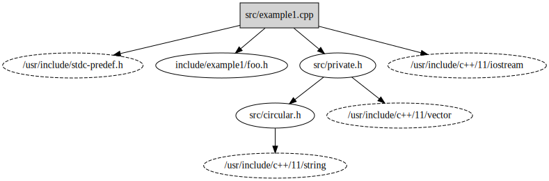

# includegraph

Generate C preprocessor `#include` graphs from a Clang compilation database

## Why?

I've been unsatisfied with tooling to understand the header dependency graph for nontrivial C++
projects, especially those that might use an embedded toolchain or generated code.

## How?

`includegraph.py` generates the header dependency graph by parsing the translation units listed in
the compilation database with `libclang` and following the preprocessor `#include`s that were
followed.

This has a limitation, in that the dependency graph lists only the `#include`s that were _actually
followed_.

## Requirements

1. Python bindings for `libclang` installed.

   There are several ways to install these bindings:
    1. `pip install libclang`. This is an unofficial project that makes the bindings from the LLVM
       project available on PyPI. This includes the `libclang.so` DSO.
    2. `pip install clang`. This is also an unofficial project. It does _not_ include the
       `libclang.so` DSO. You will need to install `libclang` yourself.
    3. From source!
2. A `compile_commands.json` compilation database for your project
3. The project source code, including any generated files.

## How do I get a compilation database?

These are the methods I currently know about.

* If your project is a CMake project, pass `-DCMAKE_EXPORT_COMPILE_COMMANDS=ON` to your CMake
  invocation.
* If you use Qt Creator as your IDE, you can go to `Build` > `Generate Compilation Database for
  "..."`.
* You can instrument your build with https://github.com/rizsotto/Bear

  You will likely need to build and install Bear from source, as the package in the default Ubuntu
  repositories is significantly out of date. Recent releases have dramatically improved Bear's
  reliability.

  To instrument your build, do

  ```sh
  make clean
  bear -- make all
  ```
  or, if you already have a compilation database, and want to append to it without having to do a
  full rebuild, you could do
  ```sh
  bear --append -- make all
  ```
  This is useful when incremental builds introduce new source files.

## How to use?

```
$ ./includegraph.py -h
usage: includegraph.py [-h] [--output OUTPUT] [--output-format {graphviz,tree}] [--log-level {CRITICAL,ERROR,WARNING,INFO,DEBUG}] build-dir

Generate the C preprocessor header dependency graph from a Clang compilation database.

positional arguments:
  build-dir             The path to the build directory containing a compilation database.

optional arguments:
  -h, --help            show this help message and exit
  --output OUTPUT, -o OUTPUT
                        The file to save the output to. Defaults to stdout.
  --output-format {graphviz,tree}, -O {graphviz,tree}
                        The output format for the parsed header dependency graph.
  --log-level {CRITICAL,ERROR,WARNING,INFO,DEBUG}, -l {CRITICAL,ERROR,WARNING,INFO,DEBUG}
                        Set the logging output level. Defaults to INFO.
```

### Example

This project includes several example C++ projects in `examples/`. Building them generates the
compilation database for each.

```sh
$ cmake -S examples/example1/ -B examples/example1/build/
$ cmake --build examples/example1/build/
$ ./includegraph.py examples/example1/build/
examples/example1/src/example1.cpp
    examples/example1/include/example1/foo.h
    examples/example1/include/example1/bar.h
    examples/example1/src/private.h
        examples/example1/src/circular.h
```

You can also generate a Graphviz diagram
```sh
$ ./includegraph.py -O graphviz examples/example1/build/
digraph header_graph {
    "examples/example1/src/example1.cpp" -> "examples/example1/include/example1/foo.h";
    "examples/example1/src/example1.cpp" -> "examples/example1/include/example1/bar.h";
    "examples/example1/src/example1.cpp" -> "examples/example1/src/private.h";
    "examples/example1/src/private.h" -> "examples/example1/src/circular.h";
}
```
which can be piped into `dot` or some other Graphviz renderer
```sh
$ ./includegraph.py examples/example1/build/ -O graphviz | dot -Tx11
```


