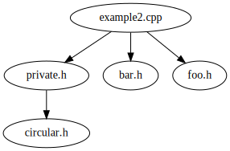
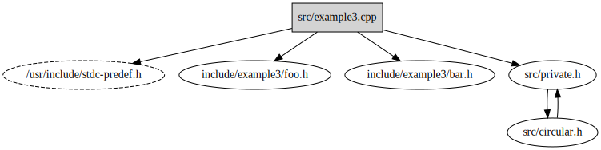

# includegraph

Generate C preprocessor `#include` graphs from a Clang compilation database

## Why?

I've been unsatisfied with tooling to understand the header dependency graph for nontrivial C++
projects, especially those that might use an embedded toolchain or generated code.

## Requirements

1. A `compile_commands.json` compilation database for your project
2. The project source code, including any generated files.

## How do I get a compilation database?

These are the methods I currently know about.

* If your project is a CMake project, pass `-DCMAKE_EXPORT_COMPILE_COMMANDS=ON` to your CMake
  invocation.
* If you use Qt Creator as your IDE, you can go to `Build` > `Generate Compilation Database for
  "..."`.

  The generated database can be awkward, as it's not generated by the source of truth (the build
  system), it's instead generated by Qt Creators internal code model. This sometimes results in
  listing commandline arguments the compiler doesn't actually accept, and sometimes groups multiple
  arguments together in the same array element. This seems to be exacerbated when using a Yocto eSDK
  for cross-compilation.
* You can instrument your build with https://github.com/rizsotto/Bear

  You will likely need to build and install Bear from source, as the package in the default Ubuntu
  repositories is significantly out of date. Recent releases have dramatically improved Bear's
  reliability.

  To instrument your build, do

  ```sh
  make clean
  bear -- make all
  ```
  or, if you already have a compilation database, and want to append to it without having to do a
  full rebuild, you could do
  ```sh
  bear --append -- make all
  ```
  This is useful when incremental builds introduce new source files. But remember that if you use
  `--append`, you won't remove old files from the database if they were removed from your source
  tree.

## How to use?

```
$ ./includegraph.py -h
usage: includegraph.py [-h] [--output OUTPUT] [--output-format {graphviz,tree}] [--log-level {CRITICAL,ERROR,WARNING,INFO,DEBUG}] compilation-database

Generate the C preprocessor header dependency graph from a Clang compilation database.

positional arguments:
  compilation-database  The path to the compilation database.

optional arguments:
  -h, --help            show this help message and exit
  --output OUTPUT, -o OUTPUT
                        The file to save the output to. Defaults to stdout.
  --output-format {graphviz,tree}, -O {graphviz,tree}
                        The output format for the parsed header dependency graph.
  --log-level {CRITICAL,ERROR,WARNING,INFO,DEBUG}, -l {CRITICAL,ERROR,WARNING,INFO,DEBUG}
                        Set the logging output level. Defaults to INFO.
```

## Examples

This project includes several example C++ projects in `examples/`. You can generate the compilation
databases for these examples by running the
[`generate-databases.sh`](examples/generate-databases.sh) script.

```sh
$ ./examples/generate-databases.sh 2>/dev/null
Generated examples/example1/build/compile_commands.json
Generated examples/example2/build/compile_commands.json
Generated examples/example3/build/compile_commands.json
```

You can then run the [`includegraph.py`](includegraph.py) script on each of the compilation
databases.

### Example 1

```sh
$ ./includegraph.py examples/example3/build/compile_commands.json
example3.cpp
    bar.h
    private.h
        circular.h
            private.h
    foo.h
```

You can also generate a Graphviz diagram
```sh
$ ./includegraph.py -O graphviz examples/example3/build/compile_commands.json
digraph header_graph {
    "example3.cpp" -> "private.h";
    "example3.cpp" -> "foo.h";
    "example3.cpp" -> "bar.h";
    "private.h" -> "circular.h";
    "circular.h" -> "private.h";
}
```
which can be piped into `dot` or some other Graphviz renderer
```sh
$ ./includegraph.py examples/example1/build/ -O graphviz | dot -Tx11
```


### Example 2
Under the hood, `includegraph.py` invokes the compile command for each entry in the compilation
database. It adds `-E` to stop after preprocessing, and strips out `-o` so that it can intercept any
and all output.

The output from the compiler looks like this:
```
$ c++ -Iexamples/example2/include -Iexamples/example2/src -c examples/example2/src/example2.cpp -E |
      grep '^#'
# 1 "examples/example2/src/example2.cpp"
# 1 "<built-in>"
# 1 "<command-line>"
# 1 "/usr/include/stdc-predef.h" 1 3 4
# 1 "<command-line>" 2
# 1 "examples/example2/src/example2.cpp"
# 1 "examples/example2/include/example2/foo.h" 1
# 2 "examples/example2/src/example2.cpp" 2
# 1 "examples/example2/include/example2/bar.h" 1
# 3 "examples/example2/src/example2.cpp" 2
# 1 "examples/example2/src/private.h" 1
# 1 "examples/example2/src/circular.h" 1
# 2 "examples/example2/src/private.h" 2
# 3 "examples/example2/src/example2.cpp" 2
```
Each of these lines is called a _linemarker_, as specified by
https://gcc.gnu.org/onlinedocs/cpp/Preprocessor-Output.html
This output is intercepted, and turned into a graph. This particular output is turned into



### Example 3
`example3` is actually _identical_ to `example2`, except for one very small difference: `example2`
uses `#pragma once` header guards, while `example3` uses `#ifndef, #define, #endif` header guards.
This difference manifests itself in the preprocessor output with regards to circular `#include`:
```
$ c++ -Iexamples/example3/include -Iexamples/example3/src -c examples/example3/src/example3.cpp -E |
      grep '^#'
# 1 "examples/example3/src/example3.cpp"
# 1 "<built-in>"
# 1 "<command-line>"
# 1 "/usr/include/stdc-predef.h" 1 3 4
# 1 "<command-line>" 2
# 1 "examples/example3/src/example3.cpp"
# 1 "examples/example3/include/example3/foo.h" 1
# 2 "examples/example3/src/example3.cpp" 2
# 1 "examples/example3/include/example3/bar.h" 1
# 3 "examples/example3/src/example3.cpp" 2
# 1 "examples/example3/src/private.h" 1
# 1 "examples/example3/src/circular.h" 1
# 1 "examples/example3/src/private.h" 1
# 4 "examples/example3/src/circular.h" 2
# 4 "examples/example3/src/private.h" 2
# 3 "examples/example3/src/example3.cpp" 2
```
This difference is because the `#pragma once` prevents the header from being included at all, while
the `#ifndef,define` header guards prevent the header's _contents_ from being included a second time
(the file is still opened and read).

This impacts the generation of the graph; circular dependencies won't be caught with `#pragma once`
header guards.



I think that libraries like Boost that do weird multiple inclusions (recursive even) would also
break the graph generation; we can't tell if subsequent inclusions are intended or not.
