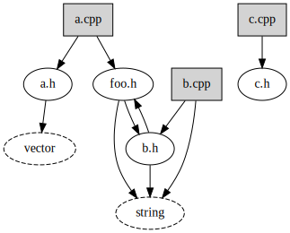
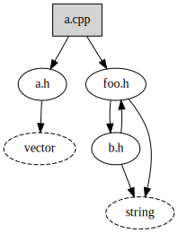
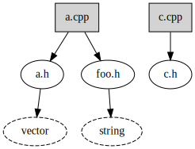

# includegraph

Generate C preprocessor `#include` graphs from a Clang compilation database

> [!Warning]
> This project is archived in favor of the (better) https://github.com/bkryza/clang-include-graph

---

## Why?

I've been unsatisfied with tooling to understand the header dependency graph for nontrivial C++
projects, especially those that might use an embedded toolchain or generated code.

## Requirements

1. A `compile_commands.json` compilation database for your project
2. The project source code, including any generated files.
3. An environment in which `includegraph.py` can invoke the compiler specified by the compilation
   database.

   E.g., if the database uses a compiler from a Yocto eSDK toolchain, you'll need to source the
   `environment-stup-*` script prior to invoking `includegraph.py`.

## How do I get a compilation database?

These are the methods I currently know about.

* If your project is a CMake project, pass `-DCMAKE_EXPORT_COMPILE_COMMANDS=ON` to your CMake
  invocation.
* If you use Qt Creator as your IDE, you can go to `Build` > `Generate Compilation Database for
  "..."`.

  The generated database can be awkward, as it's not generated by the source of truth (the build
  system), it's instead generated by Qt Creators internal code model. This sometimes results in
  listing commandline arguments the compiler doesn't actually accept, and sometimes groups multiple
  arguments together in the same array element. This seems to be exacerbated when using a Yocto eSDK
  for cross-compilation.
* You can instrument your build with https://github.com/rizsotto/Bear

  You will likely need to build and install Bear from source, as the package in the default Ubuntu
  repositories is significantly out of date. Recent releases have dramatically improved Bear's
  reliability.

  To instrument your build, do

  ```sh
  make clean
  bear -- make all
  ```
  or, if you already have a compilation database, and want to append to it without having to do a
  full rebuild, you could do
  ```sh
  bear --append -- make all
  ```
  This is useful when incremental builds introduce new source files. But remember that if you use
  `--append`, you won't remove old files from the database if they were removed from your source
  tree.

## Examples

This project includes several example C++ projects in `examples/`. You can generate the compilation
databases for these examples by running the
[`generate-databases.sh`](examples/generate-databases.sh) script.

```sh
$ ./examples/generate-databases.sh 2>/dev/null
Generated examples/example1/build/compile_commands.json
Generated examples/example2/build/compile_commands.json
Generated examples/example3/build/compile_commands.json
```

You can then run the [`includegraph.py`](includegraph.py) script on each of the compilation
databases.

### TGF graph output

The `includegraph.py` tool generates the graph in Trivial Graph Format, to support using a wide
variety of tooling to post-process or visualize the graph.

```sh
$ ./includegraph.py examples/example3/build/compile_commands.json
"examples/example3/src/example3.cpp"	"is_source_file=True, is_system_header=False, is_first_level_system_header=False"
"/usr/include/stdc-predef.h"	"is_source_file=False, is_system_header=True, is_first_level_system_header=True"
"examples/example3/include/example3/foo.h"	"is_source_file=False, is_system_header=False, is_first_level_system_header=False"
"examples/example3/include/example3/bar.h"	"is_source_file=False, is_system_header=False, is_first_level_system_header=False"
"examples/example3/src/private.h"	"is_source_file=False, is_system_header=False, is_first_level_system_header=False"
"examples/example3/src/circular.h"	"is_source_file=False, is_system_header=False, is_first_level_system_header=False"
#
"examples/example3/src/example3.cpp"	"examples/example3/include/example3/foo.h"
"examples/example3/src/example3.cpp"	"examples/example3/include/example3/bar.h"
"examples/example3/src/example3.cpp"	"/usr/include/stdc-predef.h"
"examples/example3/src/example3.cpp"	"examples/example3/src/private.h"
"examples/example3/src/private.h"	"examples/example3/src/circular.h"
"examples/example3/src/circular.h"	"examples/example3/src/private.h"
```

### Filtering subtrees

The `filtergraph.py` tool filters the TGF graph output from `includegraph.py`. This lets you
generate the full header graph once, and then prune it until it's useful for your particular use
case.

```sh
$ ./includegraph.py --full-system examples/example1/build/compile_commands.json >example1.tgf
$ wc -l example1.tgf
401
$ ./filtergraph.py -i example1.tgf --filter-transitive-system-headers
"src/example1.cpp"	"is_source_file=True, is_system_header=False, is_first_level_system_header=False"
"/usr/include/stdc-predef.h"	"is_source_file=False, is_system_header=True, is_first_level_system_header=True"
"include/example1/foo.h"	"is_source_file=False, is_system_header=False, is_first_level_system_header=False"
"src/private.h"	"is_source_file=False, is_system_header=False, is_first_level_system_header=False"
"src/circular.h"	"is_source_file=False, is_system_header=False, is_first_level_system_header=False"
"/usr/include/c++/11/string"	"is_source_file=False, is_system_header=True, is_first_level_system_header=True"
"/usr/include/c++/11/cwchar"	"is_source_file=False, is_system_header=True, is_first_level_system_header=False"
"/usr/include/c++/11/vector"	"is_source_file=False, is_system_header=True, is_first_level_system_header=True"
"/usr/include/c++/11/iostream"	"is_source_file=False, is_system_header=True, is_first_level_system_header=True"
#
"src/example1.cpp"	"/usr/include/c++/11/iostream"
"src/example1.cpp"	"/usr/include/stdc-predef.h"
"src/example1.cpp"	"src/private.h"
"src/example1.cpp"	"include/example1/foo.h"
"src/private.h"	"src/circular.h"
"src/private.h"	"/usr/include/c++/11/vector"
"src/circular.h"	"/usr/include/c++/11/string"
```

You can also provide globs for both removal patterns and exclusion patterns.

```sh
$ ./tgf2graphviz.py -i examples/circular.tgf | dot -Tx11
```



```sh
$ ./filtergraph.py --keep-only 'a.*' --keep-only 'b.h' -i examples/circular.tgf | ./tgf2graphviz.py | dot -Tx11
```



```sh
$ ./filtergraph.py --filter 'b.*' -i examples/circular.tgf | ./tgf2graphviz.py | dot -Tx11
```



### Shortening node names

By default, the tools use absolute paths for everything. But this can result in very long filenames
that make the resulting graph _quite_ ugly. Use the `--shorted-file-paths` option for
`filtergraph.py` to shorten the filenames.

```sh
$ ./filtergraph.py -i example1.tgf --filter-transitive-system-headers --shorten-file-paths
"example1.cpp"	"is_source_file=True, is_system_header=False, is_first_level_system_header=False"
"stdc-predef.h"	"is_source_file=False, is_system_header=True, is_first_level_system_header=True"
"foo.h"	"is_source_file=False, is_system_header=False, is_first_level_system_header=False"
"private.h"	"is_source_file=False, is_system_header=False, is_first_level_system_header=False"
"circular.h"	"is_source_file=False, is_system_header=False, is_first_level_system_header=False"
"string"	"is_source_file=False, is_system_header=True, is_first_level_system_header=True"
"vector"	"is_source_file=False, is_system_header=True, is_first_level_system_header=True"
"iostream"	"is_source_file=False, is_system_header=True, is_first_level_system_header=True"
#
"example1.cpp"	"private.h"
"example1.cpp"	"foo.h"
"example1.cpp"	"stdc-predef.h"
"example1.cpp"	"iostream"
"private.h"	"circular.h"
"private.h"	"vector"
"circular.h"	"string"
```

### Graphviz output

The `tgf2graphviz.py` tool takes the TGF format, and converts it to Graphviz for visualization. The
reason we go TGF -> graphviz instead of dumping strait to Graphviz, is that TGF is easier to parse,
and easier to add arbitrary metadata to, so that you can query and filter the graph after it's
dumped.

```sh
$ ./includegraph.py examples/example3/build/compile_commands.json | ./tgf2graphviz.py
digraph include_dependency_graph {
  "src/example3.cpp" [shape=box, fillcolor=lightgray, style=filled];
  "/usr/include/stdc-predef.h" [style=dashed];
  "include/example3/foo.h";
  "include/example3/bar.h";
  "src/private.h";
  "src/circular.h";

  "src/example3.cpp" -> "include/example3/bar.h";
  "src/example3.cpp" -> "/usr/include/stdc-predef.h";
  "src/example3.cpp" -> "include/example3/foo.h";
  "src/example3.cpp" -> "src/private.h";
  "src/private.h" -> "src/circular.h";
  "src/circular.h" -> "src/private.h";
}
```

which you can also pipe to `dot` to generate an SVG:
```sh
$ ./includegraph.py examples/example3/build/compile_commands.json |
    ./tgf2graphviz.py |
    dot -Tsvg -o examples/example3/graph.svg
```


### Linemarkers
Under the hood, `includegraph.py` invokes the compile command for each entry in the compilation
database. It adds `-E` to stop after preprocessing, and strips out `-o` so that it can intercept any
and all output.

The output from the compiler looks like this:
```
$ c++ -Iexamples/example2/include -Iexamples/example2/src -c examples/example2/src/example2.cpp -E |
      grep '^#'
# 1 "examples/example2/src/example2.cpp"
# 1 "<built-in>"
# 1 "<command-line>"
# 1 "/usr/include/stdc-predef.h" 1 3 4
# 1 "<command-line>" 2
# 1 "examples/example2/src/example2.cpp"
# 1 "examples/example2/include/example2/foo.h" 1
# 2 "examples/example2/src/example2.cpp" 2
# 1 "examples/example2/include/example2/bar.h" 1
# 3 "examples/example2/src/example2.cpp" 2
# 1 "examples/example2/src/private.h" 1
# 1 "examples/example2/src/circular.h" 1
# 2 "examples/example2/src/private.h" 2
# 3 "examples/example2/src/example2.cpp" 2
```
Each of these lines is called a _linemarker_, as specified by
https://gcc.gnu.org/onlinedocs/cpp/Preprocessor-Output.html
This output is intercepted, and turned into a graph.

The fact that this method can pick up on circular dependencies is why this script invokes the
preprocessor, instead of using libclang to just parse the files. In the future, I may add an
optional (because I want this to be portable, and only rely on the standard library) libclang
dependency to generate the include graph that was actually followed.

### #pragma once
`example3` is actually _identical_ to `example2`, except for one very small difference: `example2`
uses `#pragma once` header guards, while `example3` uses `#ifndef, #define, #endif` header guards.
This difference manifests itself in the preprocessor output with regards to circular `#include`:
```
$ c++ -Iexamples/example3/include -Iexamples/example3/src -c examples/example3/src/example3.cpp -E |
      grep '^#'
# 1 "examples/example3/src/example3.cpp"
# 1 "<built-in>"
# 1 "<command-line>"
# 1 "/usr/include/stdc-predef.h" 1 3 4
# 1 "<command-line>" 2
# 1 "examples/example3/src/example3.cpp"
# 1 "examples/example3/include/example3/foo.h" 1
# 2 "examples/example3/src/example3.cpp" 2
# 1 "examples/example3/include/example3/bar.h" 1
# 3 "examples/example3/src/example3.cpp" 2
# 1 "examples/example3/src/private.h" 1
# 1 "examples/example3/src/circular.h" 1
# 1 "examples/example3/src/private.h" 1
# 4 "examples/example3/src/circular.h" 2
# 4 "examples/example3/src/private.h" 2
# 3 "examples/example3/src/example3.cpp" 2
```
This difference is because the `#pragma once` prevents the header from being included at all, while
the `#ifndef,define` header guards prevent the header's _contents_ from being included a second time
(the file is still opened and read).

This impacts the generation of the graph; circular dependencies won't be caught with `#pragma once`
header guards.
